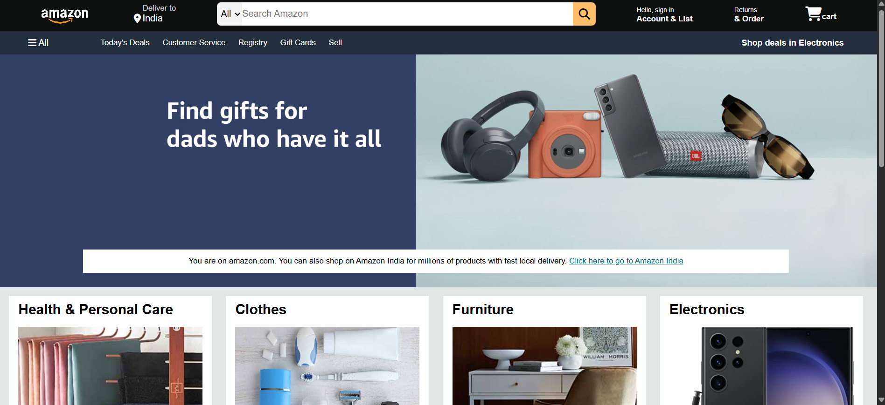

## Amazon Clone  

This is a front-end clone of the Amazon website, built using HTML, CSS, and Font Awesome icons. The project replicates the look and feel of Amazon's homepage, including the navigation bar, search functionality, shopping sections, and footer.

### 🚀 Features  
- Responsive Amazon-style navbar with search functionality  
- Various product category sections  
- Interactive hover effects for a better user experience  
- Fully structured footer with useful links  

### 📂 Project Structure  
```
📁 Amazon-Clone  
 ┣ 📂 images/         # Contains all image assets used in the project  
 ┣ 📜 index.html      # Main HTML file  
 ┣ 📜 style.css       # Stylesheet for the project  
 ┣ 📜 README.md       # Project documentation  
```

### 📸 Screenshot  
  

### 💻 Technologies Used  
- HTML  
- CSS  
- Font Awesome  